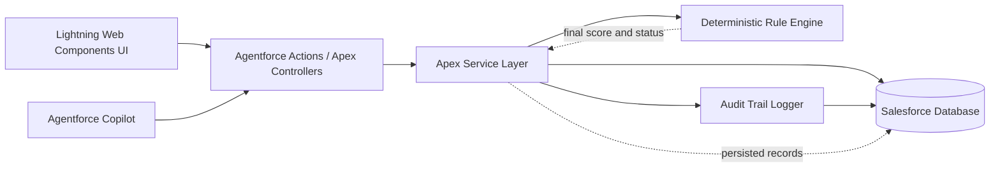
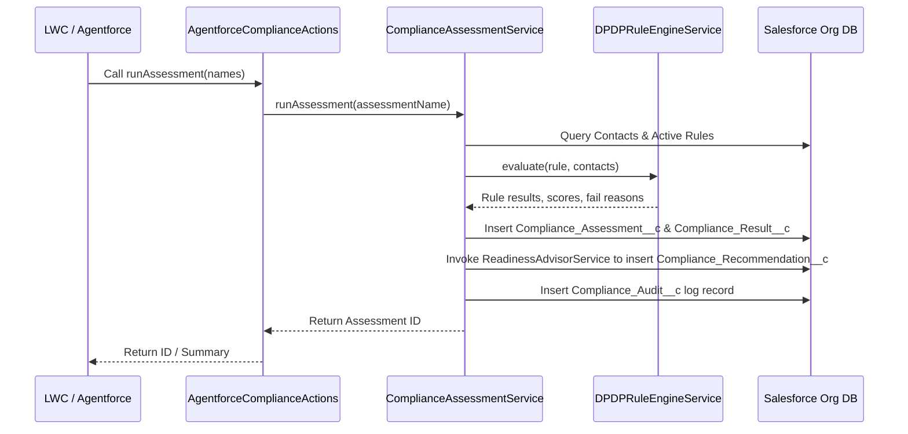

# 🛡️ ComplyLens

ComplyLens is a **platform-native Salesforce compliance operations application** engineered to evaluate customer and contact records against a deterministic interpretation of India’s **Digital Personal Data Protection Act, 2023 (DPDP)**. 🇮🇳

Unlike hybrid applications, ComplyLens is completely Salesforce-native. There is no external Express, NestJS, Java, Node.js, or Python backend. All data storage, deterministic evaluation, and business logic run directly on the Salesforce platform using **Salesforce Custom Objects** and **Apex Services**.

> ⚠️ **Core design rule:** The deterministic Apex rule engine decides the score and status. Agentforce can explain an existing result and trigger approved actions, but it cannot create, change, or override a compliance decision.

## 📌 Contents


- [🎬 Demo walkthrough](#demo-walkthrough)
- [💻 What is the backend?](#what-is-the-backend)
- [📐 Architecture](#architecture)
- [🚀 Features](#features)
- [🧰 Technology stack](#technology-stack)
- [📂 Project structure](#project-structure)
- [📏 Compliance rules and scoring](#compliance-rules-and-scoring)
- [🗄️ Database model](#database-model)
- [🔌 Apex Action / Invocable Reference](#apex-action--invocable-reference)
- [🤖 Mistral / Agentforce Integration](#mistral--agentforce-integration)
- [🛠️ Local development](#local-development)
- [🧪 Testing and verification](#testing-and-verification)
- [🔒 Security notes](#security-notes)
- [🔍 Troubleshooting](#troubleshooting)

## 🎬 Demo walkthrough

For a complete walkthrough of assessments, simulations, audit events, recommendations, and Agentforce explanations, please refer to the project documentation and LWC dashboard views.

## 💻 What is the backend?

The backend consists of four layers:

1. **Lightning Web Components (LWC)** and **Agentforce Copilot** act as the frontend interface layer.
2. **Apex service classes** in `force-app/main/default/classes/` perform assessments, scoring, recommendations, simulations, blast-radius calculations, and invocable actions.
3. **SOQL and DML operations** execute queries and persist records natively inside the Salesforce database.
4. **Salesforce Custom Objects** store contacts, consent, processing purposes, assessments, results, recommendations, and audit log events.

The UI or Agentforce Copilot triggers Apex methods (such as `ComplianceAssessmentService.runAssessment` or `FixSimulatorService.simulateFix`). Those service methods load record evidence, run the rule engine, and save results.

Agentforce is used purely as an explanation layer. It reads the persisted results and audit logs to generate guided explanations for compliance officers. It does not have access to any write operations capable of changing compliance scores or statuses unless explicitly routed through approved Apex action methods.

## 📐 Architecture



An assessment request follows this sequence:



## 🚀 Features

- Native Salesforce login, authentication, and session management
- Enterprise dashboard tracking compliance rate, at-risk contacts, and critical violations
- Deterministic contact rule evaluation (Consent, Data Retention, Children's Privacy)
- Per-rule pass/fail evidence with clear failure reasons
- Overall risk score and status calculation
- Prioritized readiness recommendations persisted to the database
- In-memory fix simulator with projected score and status outputs
- Deterministic blast-radius exposure calculations
- Secure audit log trail logging assessments, simulations, and user queries
- Integration with Agentforce Copilots via invocable Apex actions
- Seamless support for both single-contact and batch assessment execution

## 🧰 Technology stack

| Area | Technology |
|---|---|
| Platform framework | Salesforce Lightning App / SFDX |
| Frontend | Lightning Web Components (LWC) |
| Backend logic | Apex (Service Classes & Invocable Actions) |
| Database | Salesforce Database (Standard & Custom Objects) |
| Query Language | SOQL & SOSL |
| AI explanation | Agentforce Copilot |
| Styling | Salesforce Lightning Design System (SLDS) |
| Development CLI | Salesforce CLI (`sf` / `sfdx`) |
| Testing framework | Apex Test Suite (`@isTest`) |

## 📂 Project structure

```text
salesforce/
├── force-app/
│   └── main/
│       └── default/
│           └── classes/
│               ├── AgentforceComplianceActions.cls        Invocable action endpoints for Agentforce
│               ├── AgentforceComplianceActions.cls-meta.xml
│               ├── AgentforceComplianceActionsTest.cls
│               ├── AgentforceComplianceActionsTest.cls-meta.xml
│               ├── BlastRadiusService.cls                 Aggregates total database exposure metrics
│               ├── BlastRadiusService.cls-meta.xml
│               ├── BlastRadiusServiceTest.cls
│               ├── BlastRadiusServiceTest.cls-meta.xml
│               ├── ComplianceAssessmentService.cls        Assessment orchestration and database saving
│               ├── ComplianceAssessmentService.cls-meta.xml
│               ├── ComplianceAssessmentServiceTest.cls
│               ├── ComplianceAssessmentServiceTest.cls-meta.xml
│               ├── DPDPRuleEngineService.cls              Core deterministic rule evaluator
│               ├── DPDPRuleEngineService.cls-meta.xml
│               ├── DPDPRuleEngineServiceTest.cls
│               ├── DPDPRuleEngineServiceTest.cls-meta.xml
│               ├── FixSimulatorService.cls                 In-memory score projection and simulation logger
│               ├── FixSimulatorService.cls-meta.xml
│               ├── FixSimulatorServiceTest.cls
│               ├── FixSimulatorServiceTest.cls-meta.xml
│               ├── ReadinessAdvisorService.cls            Recommendation generation & assessment reporting
│               ├── ReadinessAdvisorService.cls-meta.xml
│               ├── ReadinessAdvisorServiceTest.cls
│               ├── ReadinessAdvisorServiceTest.cls-meta.xml
│               ├── RiskScoringService.cls                 Assessment risk score & status calculator
│               ├── RiskScoringService.cls-meta.xml
│               ├── RiskScoringServiceTest.cls
│               └── RiskScoringServiceTest.cls-meta.xml
├── README.md                                              Project overview and documentation
└── sfdx-project.json                                      Salesforce DX project configuration
```

## 📏 Compliance rules and scoring

Every contact begins with a score of 100. Failed rules subtract points based on rule severity.

| Code | Rule | Severity | Deduction | Deterministic check |
|---|---|---:|---:|---|
| `DPDP-001` | Consent Validation | Critical | 30 | Contact has `Consent_Status__c == 'Obtained'` |
| `DPDP-002` | Data Retention | High | 20 | Contact age (days since creation) is within `Max_Retention_Days__c` |
| `DPDP-003` | Children's Privacy | High | 50 | Minor contact must have `Parental_Consent__c == 'Obtained'` |

The score is floored at zero. Status bands are:

| Score | Status |
|---:|---|
| 80–100 | Compliant |
| 50–79 | At Risk |
| 0–49 | Non-Compliant |

The rule engine is implemented in [DPDPRuleEngineService.cls](force-app/main/default/classes/DPDPRuleEngineService.cls) as a pure logic method. It does not write to the database or depend on UI state.

### Seeded personas

The setup data includes scenario-based contacts designed to verify each rule failure:

| Contact | Scenario |
|---|---|
| Aisha Mehta | Compliant: Consent obtained, not a minor, recent data |
| Rahul Sharma | Missing active consent |
| Karan Gupta | Minor with parental consent |
| Arjun Rao | Minor without parental consent |

---

## 🗄️ Database model

ComplyLens utilizes the following custom objects and fields:

| Object | Purpose |
|---|---|
| `Contact` | Standard object enhanced with compliance status fields (`Consent_Status__c`, `Is_Minor__c`, `Parental_Consent__c`) |
| `Compliance_Assessment__c` | Header record tracking assessment run execution date, score, status, and audits |
| `Compliance_Rule__c` | Metadata defining rule type, severity score, and maximum data retention days |
| `Compliance_Result__c` | Junction record storing pass/fail details and reasons for a specific rule on a contact |
| `Compliance_Recommendation__c` | Priority actions mapped to assessments showing estimated score gains and effort |
| `Compliance_Audit__c` | Immutable logging trail documenting assessment runs and simulation runs |

---

## 🔌 Apex Action / Invocable Reference

To integrate with Agentforce, the application exposes public invocable methods via [AgentforceComplianceActions.cls](force-app/main/default/classes/AgentforceComplianceActions.cls).

### `Run Compliance Assessment`
* **Apex Method**: `runAssessment`
* **Description**: Triggers a full compliance assessment run. Creates assessment, result, recommendation, and audit records.
* **Input**: List of assessment names (Strings).
* **Output**: List of generated assessment IDs (Strings).

### `Get Readiness Report`
* **Apex Method**: `getReadinessReport`
* **Description**: Returns a structured summary report containing overall risk score, readiness level, and recommended top fixes.
* **Input**: List of assessment IDs (Strings).
* **Output**: List of report summaries (Strings).

---

## 🤖 Mistral / Agentforce Integration

Agentforce is configured as an explainer layer:
1. When a user asks: *"Why is Arjun Rao non-compliant?"*, Agentforce calls the `getReadinessReport` invocable action.
2. The action retrieves the score, status, failed rules, and recommendations from the Salesforce database.
3. Agentforce formats and presents this data to the user, explaining the compliance status using the deterministic results.
4. All Agentforce queries and interactions can be logged to `Compliance_Audit__c` records.

---

## 🛠️ Local development

### Prerequisites
- Salesforce CLI (`sf` or `sfdx`)
- Access to a Salesforce Developer Org, Scratch Org, or Sandbox

### 1. Authorize your Org
Authorize your target deployment Salesforce Org:
```bash
sf org login web -a complylens-org
```

### 2. Deploy source metadata
Deploy the backend Apex service classes and metadata configurations to your authorized Org:
```bash
sf project deploy start --target-org complylens-org
```

### 3. Run Apex Unit Tests
Verify the deployment and validate the business logic by running all ComplyLens unit tests:
```bash
sf apex run test --target-org complylens-org --wait 10
```

---

## 🧪 Testing and verification

The Apex test suite covers all logic branches:
- [DPDPRuleEngineServiceTest.cls](force-app/main/default/classes/DPDPRuleEngineServiceTest.cls): Verifies evaluation logic across all three rules (Consent, Retention, Children's Privacy).
- [RiskScoringServiceTest.cls](force-app/main/default/classes/RiskScoringServiceTest.cls): Validates score calculations and edge cases.
- [BlastRadiusServiceTest.cls](force-app/main/default/classes/BlastRadiusServiceTest.cls): Tests total contact exposure calculations.
- [FixSimulatorServiceTest.cls](force-app/main/default/classes/FixSimulatorServiceTest.cls): Tests simulation projections and audit logging.
- [ReadinessAdvisorServiceTest.cls](force-app/main/default/classes/ReadinessAdvisorServiceTest.cls): Tests recommendation generation.
- [ComplianceAssessmentServiceTest.cls](force-app/main/default/classes/ComplianceAssessmentServiceTest.cls): Tests full orchestration and database persistence.
- [AgentforceComplianceActionsTest.cls](force-app/main/default/classes/AgentforceComplianceActionsTest.cls): Validates Agentforce invocable methods.

---

## 🔒 Security notes

- All database queries and writes follow Salesforce governor limits and best practices (bulkified queries).
- Real data assessments must be executed in sandboxes or verified secure environments.
- Always consult with privacy/legal teams to validate rule thresholds, consent statuses, and processing parameters before using the application for official legal determinations under the DPDP Act.

---

## 🔍 Troubleshooting

### Deployment Conflicts
If deployment fails due to missing custom objects or fields, verify that `Compliance_Assessment__c`, `Compliance_Rule__c`, `Compliance_Result__c`, `Compliance_Recommendation__c`, and `Compliance_Audit__c` custom objects have been properly created on the target Salesforce Org.

### Verification Failures
If unit tests fail, check that you have active rule records and contact data in the org, as mock records are inserted during test setup but some assertions depend on specific rule configurations.
