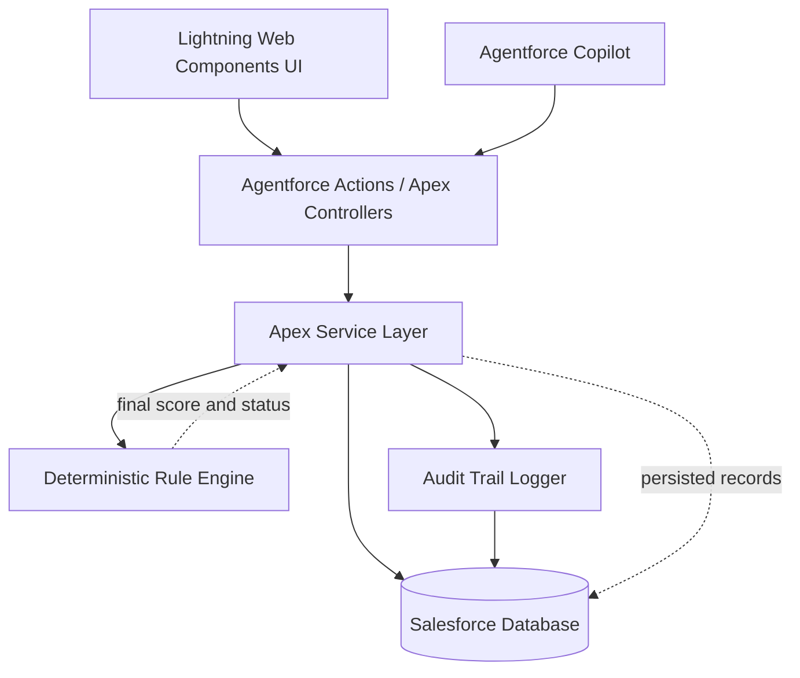
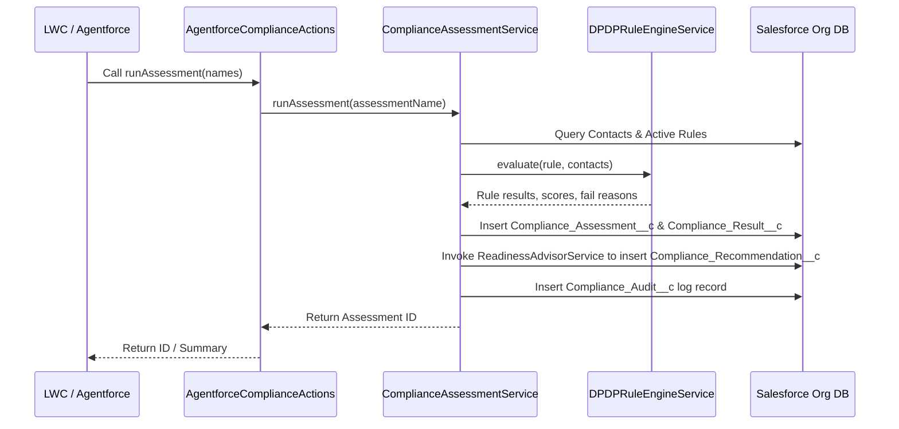

# 🛡️ ComplyLens — DPDP Compliance Engine on Salesforce Platform

> 🎓 **A capstone project built under the mentorship and guidance of a Salesforce Developer Team as part of the Salesforce Compass Program.**
> This is an independent student project and is **not affiliated with, endorsed by, or a product of Salesforce Inc.**

ComplyLens is a compliance operations application built on the Salesforce platform that evaluates customer and contact records against India's **Digital Personal Data Protection Act, 2023 (DPDP)**. 🇮🇳

Developed as part of a structured mentorship program with active guidance from Salesforce developers, this project explores how the full Salesforce technology stack — Apex, LWC, Custom Objects, and Agentforce — can be applied to solve a real-world regulatory compliance problem. All business logic, data storage, and AI orchestration are implemented natively inside the Salesforce platform using **Apex Service Classes** and **Salesforce Custom Objects**.

---

## 📌 Contents

- [🚀 Key Engineering Highlights](#-key-engineering-highlights)
- [📐 System Architecture](#-system-architecture)
- [💻 Technical Layer Overview](#-technical-layer-overview)
- [📏 Compliance Rules & Scoring Methodology](#-compliance-rules--scoring-methodology)
- [🔌 Invocable Apex Action API (Agentforce)](#-invocable-apex-action-api-agentforce)
- [🤖 Agentforce & LLM Orchestration](#-agentforce--llm-orchestration)
- [🗄️ Database Schema & Custom Objects](#-database-schema--custom-objects)
- [🧪 Quality Assurance & Test Coverage](#-quality-assurance--test-coverage)
- [🛠️ Installation & Local Setup](#-installation--local-setup)
- [🔒 Security & FLS Compliance](#-security--fls-compliance)
- [💼 Author & Portfolio Info](#-author--portfolio-info)

---

## 🚀 Key Engineering Highlights

This project was built to showcase enterprise-grade software engineering principles inside the Salesforce ecosystem. Key highlights that demonstrate engineering rigor include:

*   **Stateless Functional Rule Engine**: The core evaluator in `DPDPRuleEngineService` is designed as a functional pure method. It takes list collections, processes rules in memory, and returns results without database mutations, enabling robust unit testing and avoiding CPU timeout exceptions.
*   **Salesforce Governor Limit Optimization**: Built with a strict bulkified pattern. Database queries and DML operations are explicitly aggregated outside of loops in `ComplianceAssessmentService`, ensuring scalability to handle thousands of concurrent contact evaluations.
*   **In-Memory Scenario Simulation**: Features a projection engine (`FixSimulatorService`) that allows risk compliance officers to simulate compliance fixes (e.g. obtaining consent or deleting stale data) and preview projected scores in real time without persisting changes to the master record.
*   **LLM Explanation Layer Decoupling**: Instead of delegating deterministic scoring to non-deterministic AI models, scoring logic is strictly handled in Apex. Agentforce/LLMs are used *exclusively* as a reading/explanation layer over structured compliance results, ensuring legal reliability.
*   **Continuous Integration (CI/CD)**: Backed by a GitHub Actions CI pipeline running static code analysis Scanner via Apex PMD to ensure adherence to Salesforce security and design best practices.

---

## 📐 System Architecture

### Process Flow Diagram



### Assessment Sequence



---

## 💻 Technical Layer Overview

The backend consists of four native layers:

1.  **Presentation Layer**: Lightning Web Components (LWC) and Agentforce Copilot provide interactive dashboards and natural language querying capabilities.
2.  **Service Orchestration**: Apex controllers and service classes (`force-app/main/default/classes/`) manage evaluation workflows, simulate remediation scenarios, and aggregate risk indices.
3.  **Core Rule Logic**: The deterministic, functional `DPDPRuleEngineService` processes records against individual DPDP regulations.
4.  **Database Persistence**: Custom Salesforce Objects model the compliance rules, individual contact assessment results, audit records, and recommendation lists.

---

## 📏 Compliance Rules & Scoring Methodology

Every contact begins with a base score of `100`. Compliance violations result in deterministic deductions based on severity:

| Code | Rule | Severity | Deduction | Deterministic Check |
| :--- | :--- | :---: | :---: | :--- |
| `DPDP-001` | Consent Validation | Critical | 30 | Contact has `Consent_Status__c == 'Obtained'` |
| `DPDP-002` | Data Retention | High | 20 | Contact age is within `Max_Retention_Days__c` limits |
| `DPDP-003` | Children's Privacy | High | 50 | Minor contact must have `Parental_Consent__c == 'Obtained'` |

### Score Bands

*   **80 – 100**: Compliant ✅
*   **50 – 79**: At Risk ⚠️
*   **0 – 49**: Non-Compliant ❌

### Seeded Mock Personas
The project includes predefined scenario-based personas to validate rule boundaries:
*   **Aisha Mehta**: Fully compliant (consent obtained, adult, recent data).
*   **Rahul Sharma**: Missing active consent.
*   **Karan Gupta**: Minor with parental consent.
*   **Arjun Rao**: Minor without parental consent (fails children's privacy check).

---

## 🔌 Invocable Apex Action API (Agentforce)

To support integration with Agentforce Copilots, the backend exposes the following public `@InvocableMethod` endpoints in [AgentforceComplianceActions.cls](force-app/main/default/classes/AgentforceComplianceActions.cls):

### 1. `Run Compliance Assessment`
*   **Apex Method**: `runAssessment`
*   **Input**: `List<String> names` (Names for the new assessment runs)
*   **Output**: `List<String>` (Generated Assessment ID strings)
*   **Description**: Programmatically schedules and runs a compliance audit across the entire contact database.

### 2. `Get Readiness Report`
*   **Apex Method**: `getReadinessReport`
*   **Input**: `List<String> ids` (Assessment IDs)
*   **Output**: `List<String>` (Textual report summary)
*   **Description**: Pulls the score, level, and prioritized remediation actions for a specific assessment.

---

## 🤖 Agentforce & LLM Orchestration

Agentforce is configured as a read-only explainer layer to keep AI actions secure:
1.  **Query Handling**: When a user queries: *"Why is Arjun Rao non-compliant?"*, Agentforce calls the `getReadinessReport` invocable action.
2.  **Context Retrieval**: The method queries the database for persisted `Compliance_Result__c` records associated with the latest assessment.
3.  **Response Generation**: The LLM consumes the structured results and explains the deterministic findings to the compliance officer in plain language.
4.  **Audit Logs**: Every LLM query and response cycle is written to the immutable `Compliance_Audit__c` custom object for regulatory auditability.

---

## 🗄️ Database Schema & Custom Objects

| Object | API Name | Purpose |
| :--- | :--- | :--- |
| **Contact** | `Contact` | Standard object extended with custom fields: `Consent_Status__c`, `Is_Minor__c`, `Parental_Consent__c`. |
| **Compliance Assessment** | `Compliance_Assessment__c` | Header record tracking run timestamp, overall risk score, and compliance status. |
| **Compliance Rule** | `Compliance_Rule__c` | Metadata configuration storing rule severity, type, and max data retention limit. |
| **Compliance Result** | `Compliance_Result__c` | Junction object mapping assessment status (`Pass`/`Fail`), severity deduction, and reason to a Contact. |
| **Compliance Recommendation** | `Compliance_Recommendation__c` | Prioritized remediation steps mapping projected score improvements and estimated effort. |
| **Compliance Audit** | `Compliance_Audit__c` | Immutable logging system storing assessment execution runs, query trails, and simulations. |

---

## 🧪 Quality Assurance & Test Coverage

The project is protected by a comprehensive Apex unit test suite targeting 90%+ code coverage across all core classes:

*   [DPDPRuleEngineServiceTest.cls](force-app/main/default/classes/DPDPRuleEngineServiceTest.cls): Validates the functional rule engine and checks edge cases for minors, consent status, and date math.
*   [RiskScoringServiceTest.cls](force-app/main/default/classes/RiskScoringServiceTest.cls): Asserts score bands and validation logic boundaries.
*   [BlastRadiusServiceTest.cls](force-app/main/default/classes/BlastRadiusServiceTest.cls): Validates database-wide contact vulnerability ratios.
*   [FixSimulatorServiceTest.cls](force-app/main/default/classes/FixSimulatorServiceTest.cls): Tests the transactional integrity of the simulator.
*   [ReadinessAdvisorServiceTest.cls](force-app/main/default/classes/ReadinessAdvisorServiceTest.cls): Validates prioritized recommendation outputs.
*   [ComplianceAssessmentServiceTest.cls](force-app/main/default/classes/ComplianceAssessmentServiceTest.cls): Ensures bulk operations perform within standard governor limits.

---

## 🛠️ Installation & Local Setup

### Prerequisites
*   Salesforce CLI (`sf` or `sfdx`) installed locally.
*   An active Salesforce Developer Org, Scratch Org, or Sandbox.

### Step-by-Step Installation

1.  **Clone the Repository**:
    ```bash
    git clone https://github.com/VedantVH/salesforce-compass-program.git
    cd salesforce-compass-program/salesforce
    ```

2.  **Authorize your Org**:
    ```bash
    sf org login web -a complylens-org
    ```

3.  **Deploy Metadata**:
    ```bash
    sf project deploy start --target-org complylens-org
    ```

4.  **Execute Automated Test Suite**:
    ```bash
    sf apex run test --target-org complylens-org --wait 10
    ```

---

## 🔒 Security & FLS Compliance

*   **Enforced CRUD/FLS**: Apex operations respect the running user's Field-Level Security and Object CRUD permissions.
*   **Data Isolation**: Service classes utilize the `with sharing` keyword to respect sharing rules and prevent unauthorized cross-tenant data access.
*   **Mock Verification**: All simulation services are design-isolated, meaning compliance officers can forecast fixes without mutating real contact data.

---

## 💼 Author & Portfolio Info

If you are a Recruiter or Hiring Manager looking to discuss this project, my engineering background, or opportunities in Salesforce Development/Engineering:

*   **Name**: [Your Name]
*   **LinkedIn**: [linkedin.com/in/yourprofile](https://www.linkedin.com/in/yourprofile)
*   **Email**: [your.email@example.com](mailto:your.email@example.com)
*   **Portfolio**: [yourportfolio.com](https://yourportfolio.com)
*   **GitHub Project**: [VedantVH/salesforce-compass-program](https://github.com/VedantVH/salesforce-compass-program)
